## When dealing with machine learning problems, there are generally two types of data (and machine learning models):

- `Supervised data:` always has one or multiple targets associated with it.
- `Unsupervised data:` does not have any target variable.

A supervised problem is considerably easier to tackle than an unsupervised one. A problem in which we are required to predict a value is known as a supervised problem. 
For example, if the problem is to predict house prices given historical house prices, with features like presence of a hospital, school or supermarket, distance to nearest public transport, etc. is a unsupervised problem. 

Similarly, when we are provided with images of cats and dogs, and we know beforehand which ones are cats and which ones are dogs, and if the task is to create a model which predicts whether a provided image is of a cat or a dog, the problem is considered to be supervised.

## Here in this Dataset we have a Supervised Machine Learning Problem, For Heart Failure Prediction

Cardiovascular diseases (CVDs) are the number 1 cause of death globally, taking an estimated 17.9 million lives each year, which accounts for 31% of all deaths worldwide. Four out of 5CVD deaths are due to heart attacks and strokes, and one-third of these deaths occur prematurely in people under 70 years of age. Heart failure is a common event caused by CVDs and this dataset contains 11 features that can be used to predict a possible heart disease.

People with cardiovascular disease or who are at high cardiovascular risk (due to the presence of one or more risk factors such as hypertension, diabetes, hyper-lidipaemia or already established disease) need early detection and management wherein a machine learning model can be of great help


### Getting Started with our Data

The describe() function in pandas is very handy in getting various summary statistics.This function returns the count, mean, standard deviation, minimum and maximum values and the quantities of the data

```python

import numpy as np 
import pandas as pd 

df = pd.read_csv("Code/heart.csv")
print(df.head())

print(df.dtypes)


```
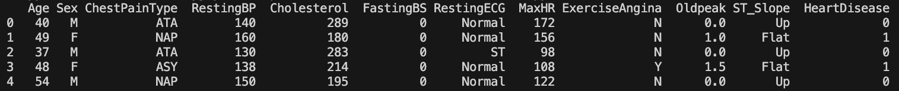
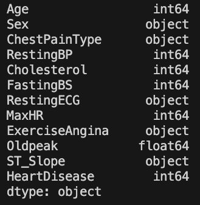

As we can see the string data in the data-frame is in the form of object, we need to convert it back to string to work on it.

```python

string_col = df.select_dtypes(include="object").columns
df[string_col]=df[string_col].astype("string")
print(df.dtypes)
```
So, as we can see here the object data has been converted to string

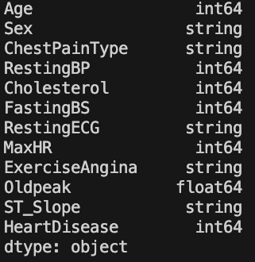

### Getting the categorical columns


- `Age:` age of the patient [years]
- `Sex:` sex of the patient [M: Male, F: Female]
- `ChestPainType:` chest pain type [TA: Typical Angina, ATA: Atypical Angina, NAP: Non-Anginal Pain, ASY: Asymptomatic]
- `RestingBP:` resting blood pressure [mm Hg]
- `Cholesterol:` serum cholesterol [mm/dl]
- `FastingBS:` fasting blood sugar [1: if FastingBS > 120 mg/dl, 0: otherwise]
- `RestingECG:` resting electrocardiogram results [Normal: Normal, ST: having ST-T wave abnormality (T wave inversions and/or ST elevation or depression of > 0.05 mV), LVH: showing probable or definite left ventricular hypertrophy by Estes' criteria]
- `MaxHR:` maximum heart rate achieved [Numeric value between 60 and 202]
- `ExerciseAngina:` exercise-induced angina [Y: Yes, N: No]
- `Oldpeak:` oldpeak = ST [Numeric value measured in depression]
- `ST_Slope:` the slope of the peak exercise ST segment [Up: upsloping, Flat: flat, Down: downsloping]
- `HeartDisease:` output class [1: heart disease, 0: Normal]


### Exploratory Data Analysis

First Question should be why do we need this ??
Out Come of this phase is as given below :

- Understanding the given dataset and helps clean up the given dataset.
- It gives you a clear picture of the features and the relationships between them.
- Providing guidelines for essential variables and leaving behind/removing non-essential variables.
- Handling Missing values or human error.
- Identifying outliers.
- EDA process would be maximizing insights of a dataset.
- This process is time-consuming but very effective, 

### Correlation Matrix
Its necessary to remove correlated variables to improve your model.One can find correlations using pandas “.corr()” function and can visualize the correlation matrix using plotly express.

- Lighter shades represents positive correlation
- Darker shades represents negative correlation


- A `positive correlation` is a relationship between two variables in which both variables move in the same direction. Therefore, when one variable increases as the other variable increases, or one variable decreases while the other decreases. An example of positive correlation would be height and weight. Taller people tend to be heavier.

- A `negative correlation` is a relationship between two variables in which an increase in one variable is associated with a decrease in the other. An example of negative correlation would be height above sea level and temperature. As you climb the mountain (increase in height) it gets colder (decrease in temperature).

- A `zero correlation` exists when there is no relationship between two variables. For example there is no relationship between the amount of tea drunk and level of intelligence.

```python 

img = px.imshow(df.corr(),title="Correlation Plot of the Heart Failure Prediction")
img.show()

```
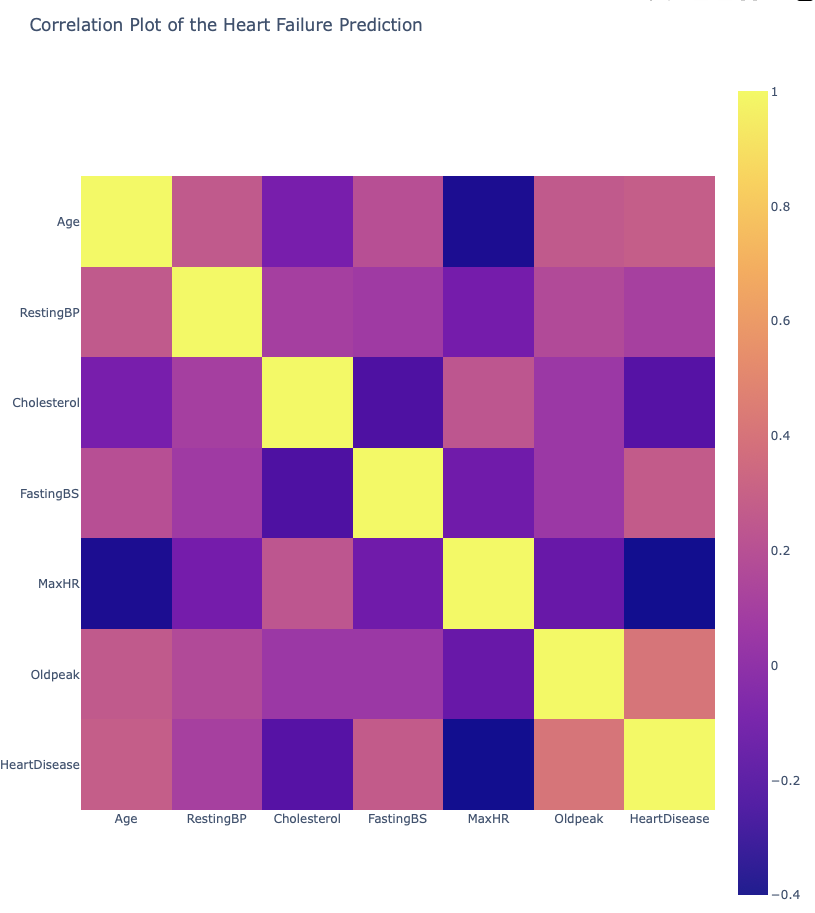

Here we can see Heart Disease has a high negative correlation with "MaxHR" and somewhat negative correlation with "Cholesterol", where as here positive correlation with "Oldpeak","FastingBS" and "RestingBP"

`Distribution of Heart Diseases` 
```python

# Shows the Distribution of Heat Diseases with respect to male and female
fig=px.histogram(df, 
                 x="HeartDisease",
                 color="Sex",
                 hover_data=df.columns,
                 title="Distribution of Heart Diseases",
                 barmode="group")
fig.show()

```
Shows the Distribution of Heart Diseases with respect to male and female
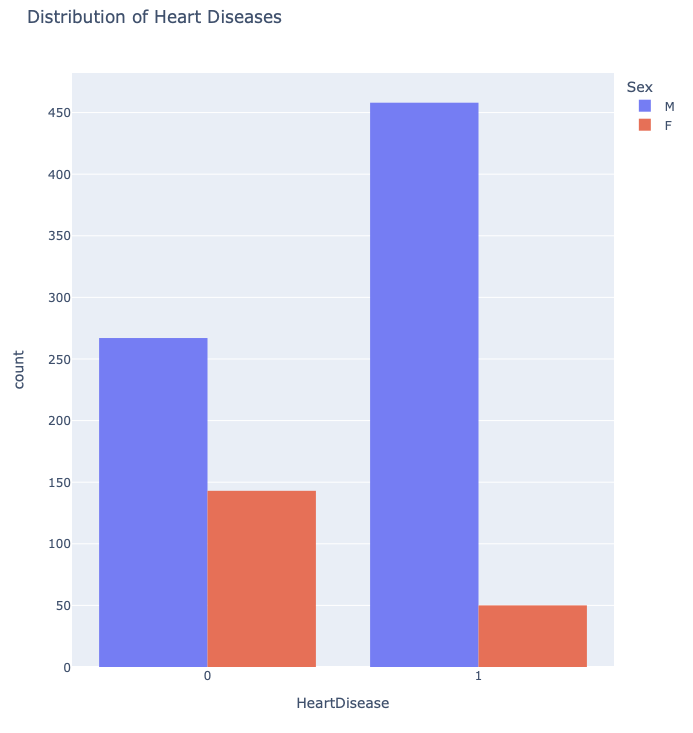

`Chest Pain Type`
```python
fig1 = px.histogram(df,
                 x="ChestPainType",
                 color="Sex",
                 hover_data=df.columns,
                 title="Types of Chest Pain"
                )
fig1.show()
```
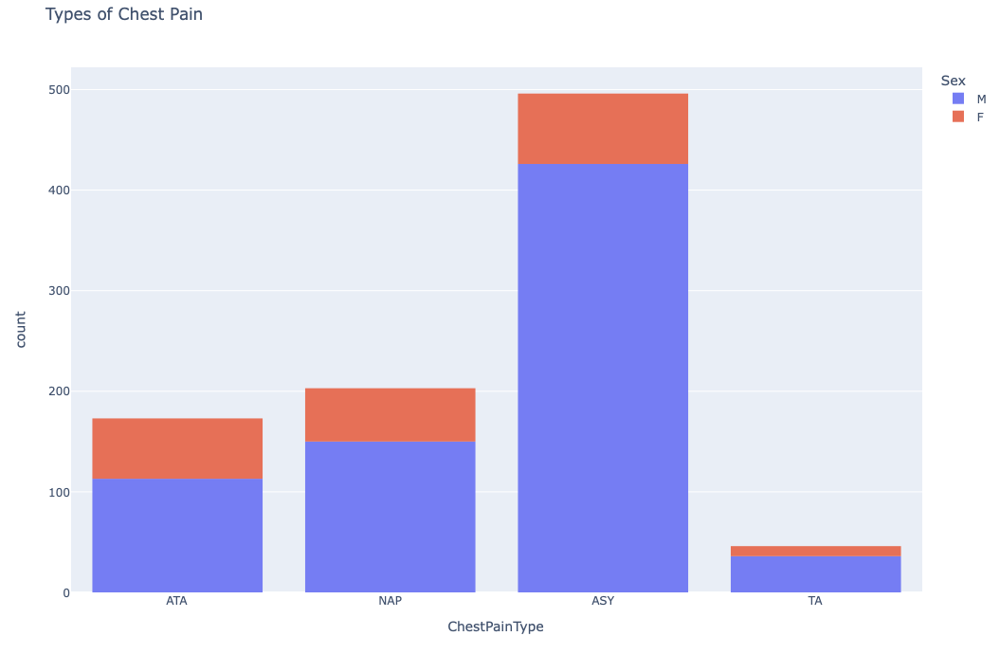

`Sex Ratio`
```python
fig2 = px.histogram(df,
                 x="Sex",
                 hover_data=df.columns,
                 title="Sex Ratio in the Data")
fig2.show()
```
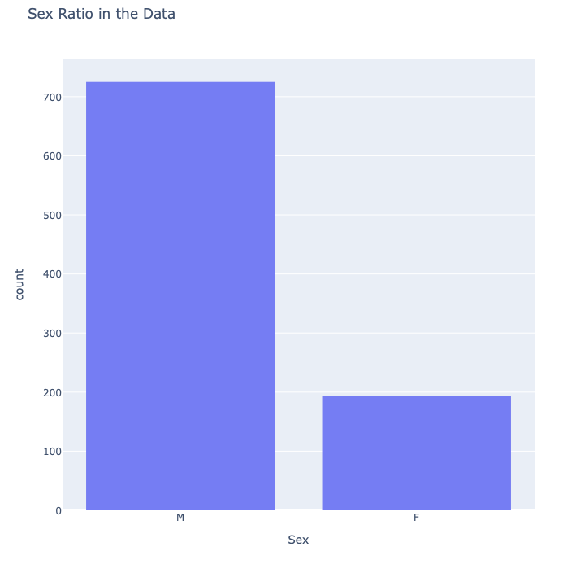

`Distribution of Resting ECG`
```python
fig3 = px.histogram(df,
                 x="RestingECG",
                 hover_data=df.columns,
                 title="Distribution of Resting ECG")
fig3.show()
```
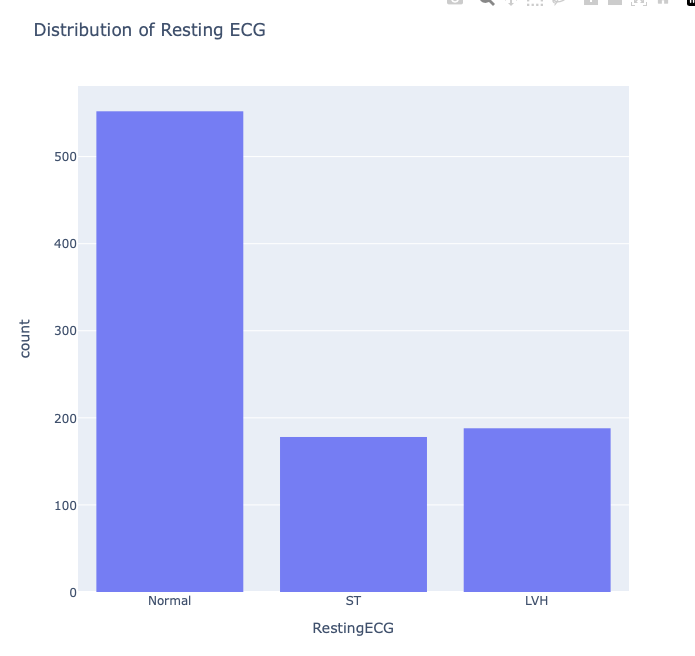

`Pair Plots`

To plot multiple pairwise bivariate distributions in a dataset, you can use the `pairplot()` function. This shows the relationship for (n, 2) combination of variable in a DataFrame as a matrix of plots and the diagonal plots are the univariate plots.

An effective way to familiarize with a dataset during exploratory data analysis is using a pairs plot (also known as a scatter plot matrix). A pairs plot allows to see both the `distribution of single variables and relationships between two variables in a dataset.`

Pair plots are a great method to identify trends for follow-up analysis.

By default, this function will create a grid of Axes such that each numeric variable in data will by shared across the y-axes across a single row and the x-axes across a single column. The diagonal plots are treated differently: a univariate distribution plot is drawn to show the marginal distribution of the data in each column.


```python
plt.figure(figsize=(12,10))
sns.pairplot(df,hue="HeartDisease")
plt.title("Looking for Insights in Data")
plt.legend("HeartDisease")
plt.tight_layout()
plt.plot()
plt.show()
```

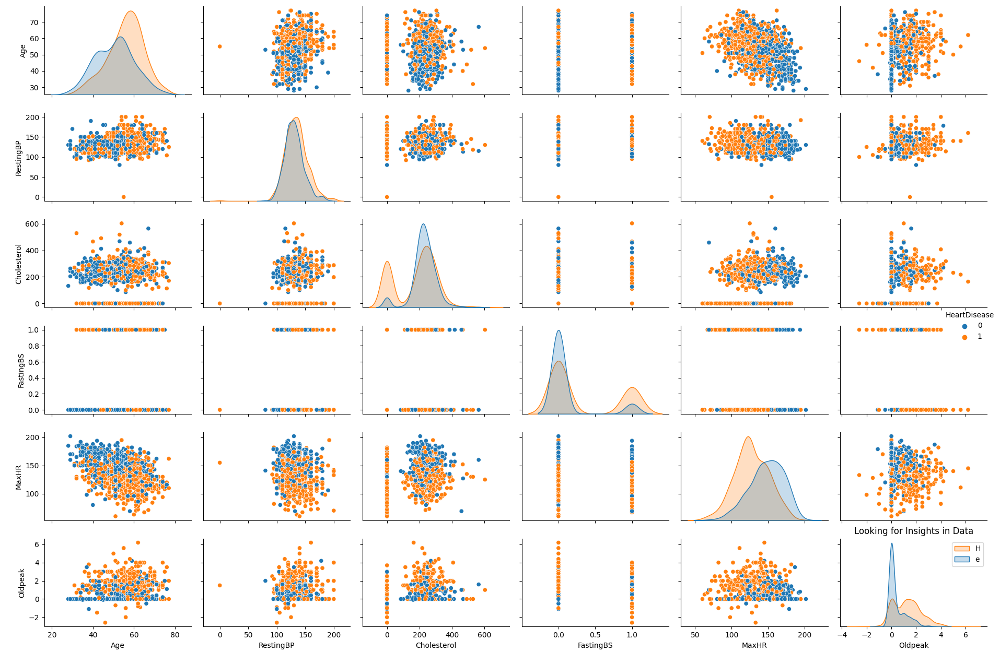


`Distribution of Data`

Now to check the `linearity of the variables` it is a good practice to plot distribution graph and look for `skewness of features`. Kernel density estimate (kde) is a quite useful tool for plotting the shape of a distribution.

`Kernel density estimation` is a really useful statistical tool with an intimidating name. Often shortened to KDE, it’s a technique that let’s you create a smooth curve given a set of data.

This can be useful if you want to visualize just the “shape” of some data, as a kind of continuous replacement for the discrete histogram. It can also be used to generate points that look like they came from a certain dataset - this behavior can power simple simulations, where simulated objects are `modeled off of real data`.


The first thing you usually notice about a distribution’s shape is whether it has one mode (peak) or more than one. If it’s `unimodel` (has just one peak), like most data sets, the next thing you notice is whether it’s `symmetric or skewed` to one side. If the bulk of the data is at the left and the right tail is longer, we say that the distribution is `skewed right or positively skewed`; if the peak is toward the right and the left tail is longer, we say that the distribution is `skewed left or negatively skewed`.


```python

plt.figure(figsize=(15,10))
for i,col in enumerate(df.columns,1):
    plt.subplot(4,3,i)
    plt.title(f"Distribution of {col} Data")
    sns.histplot(df[col],kde=True)
    plt.tight_layout()
    plt.plot()
plt.show()

```
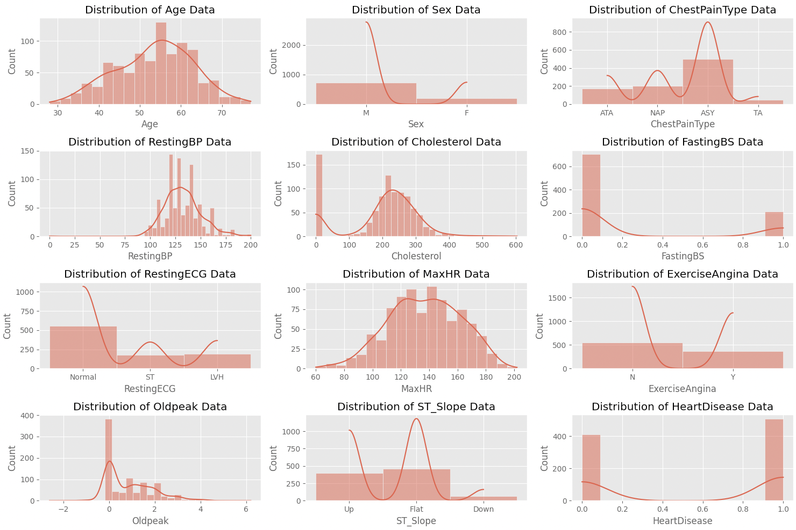


### Outliers

A `box plot` (or box-and-whisker plot) shows the distribution of quantitative data in a way that facilitates comparisons between variables.
The box shows the quartiles of the dataset while the whiskers extend to show the rest of the distribution.
The box plot (a.k.a. box and whisker diagram) is a standardized way of displaying the distribution of data based on the five number summary:

- `Minimum`
- `First quartile`
- `Median`
- `Third quartile`
- `Maximum`

In the simplest box plot the central rectangle spans the first quartile to the third quartile (the interquartile range or IQR). A segment inside the rectangle shows the median and “whiskers” above and below the box show the locations of the minimum and maximum.


`Distribution of Age`

```python
fig = px.box(df,y="Age",x="HeartDisease",title=f"Distribution of Age")
fig.show()
```

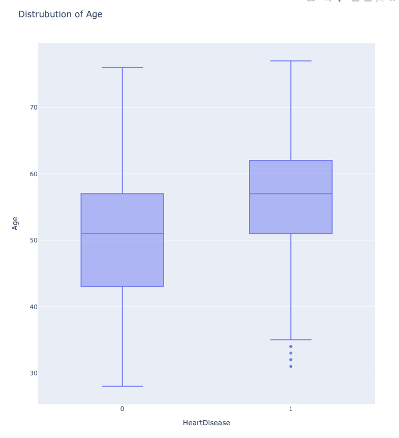

`Distribution of RestingBP`

```python
fig = px.box(df,y="RestingBP",x="HeartDisease",title=f"Distribution of RestingBP",color="Sex")
fig.show()
```
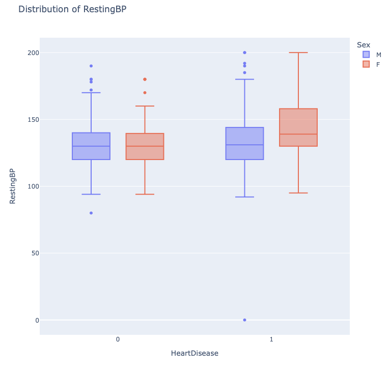


`Distribution of Cholesterol`

```python
fig = px.box(df,y="Cholesterol",x="HeartDisease",title=f"Distribution of Cholesterol")
fig.show()
```

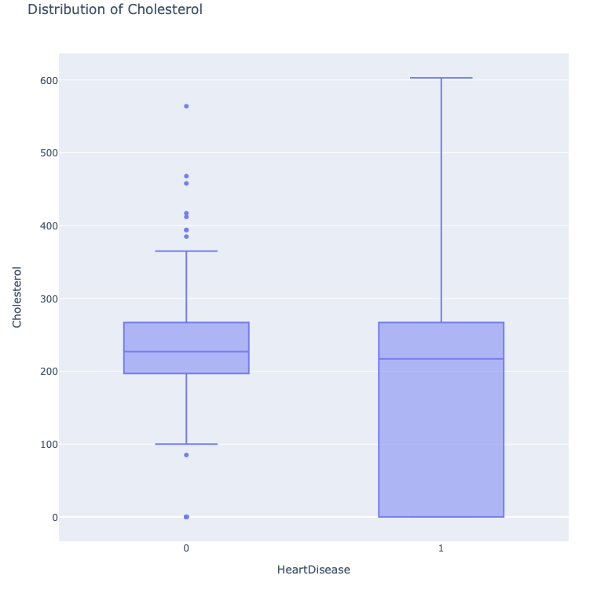

`Distribution of Oldpeak`

```python
fig = px.box(df,y="Oldpeak",x="HeartDisease",title=f"Distribution of Oldpeak")
fig.show()
```

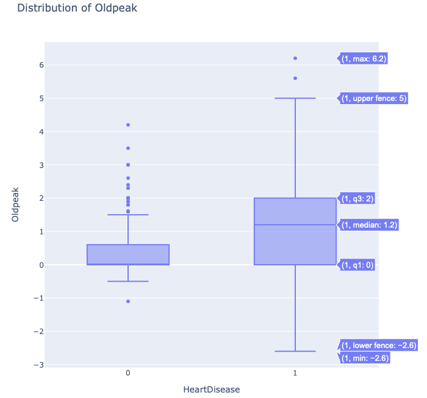

`Distribution of MaxHR`

```python
fig = px.box(df,y="MaxHR",x="HeartDisease",title=f"Distribution of MaxHR")
fig.show()
```

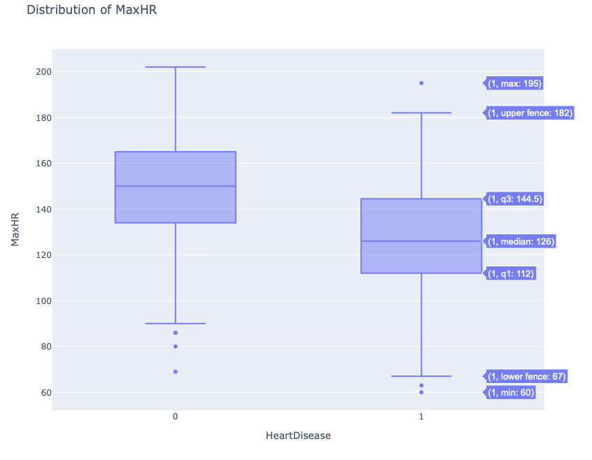


### Data Preprocessing

`Data preprocessing` is an integral step in Machine Learning as the quality of data and the useful information that can be derived from it directly affects the ability of our model to learn; therefore, it is extremely important that we pre-process our data before feeding it into our model.


- `Handling Null Values`
- `Feature Scaling`
- `Handling Categorical Variables`


### Handling Null Values

In any real-world dataset, there are always few null values. It doesn’t really matter whether it is a regression, classification or any other kind of problem, no model can handle these `NULL` or `NaN` values on its own so we need to intervene.

In python NULL is represented with NaN. So don’t get confused between these two, they can be used interchangeably.

```python
# Checking for Type of data
print(df.info())
```
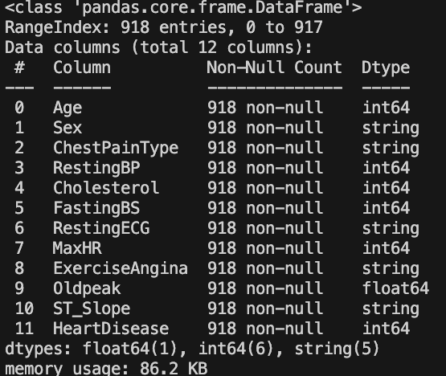

```python
# Checking for NULLs in the data
print(df.isnull().sum())
```
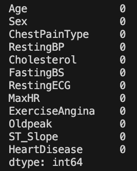


So we can see our data does not have any null values but in case we have missing values, we can remove the data as well.

However, it is not the best option to remove the rows and columns from our dataset as it can result in significant `information loss`. 

If you have 300K data points then removing 2–3 rows won’t affect your dataset much but if you only have 100 data points and out of which 20 have NaN values for a particular field then you can’t simply drop those rows. 

In real-world datasets, it can happen quite often that you have a `large number of NaN values` for a particular field. Ex — Suppose we are collecting the data from a survey, then it is possible that there could be an optional field which let’s say 20% of people left blank. 

So when we get the dataset then we need to understand that the remaining 80% of data is still useful, so rather than dropping these values we need to somehow substitute the missing 20% values. We can do this with the help of Imputation.

`Imputation`

Imputation is simply the process of substituting the missing values of our dataset. We can do this by defining our own customized function or we can simply perform imputation by using the SimpleImputer class provided by sklearn.

For example:

```python
from sklearn.impute import SimpleImputer

imputer = SimpleImputer(missing_values=np.nan, strategy='mean')
imputer = imputer.fit(df[['Weight']])
df['Weight'] = imputer.transform(df[['Weight']])
```

### Feature Scaling

`Why Should we Use Feature Scaling?`

The first question we need to address – why do we need to scale the variables in our dataset? Some machine learning algorithms are sensitive to feature scaling while others are virtually invariant to it. 

### Distance Based Algorithms

Distance algorithms like `"KNN", "K-means" and "SVM"` are most affected by the range of features. This is because behind the scenes they are using distances between data points to determine their similarity. 

When two features have different scales, there is a chance that higher weightage is given to features with higher magnitude. This will impact the performance of the machine learning algorithm and obviously, we do not want our algorithm to be `biased` towards one feature.

Therefore, we `scale our data` before employing a distance based algorithm so that all the features contribute equally to the result.

### Tree-Based Algorithms

`Tree-based algorithms`, on the other hand, are fairly insensitive to the scale of the features. A decision tree is only `splitting a node based on a single feature`. The decision tree splits a node on a feature that increases the homogeneity of the node. This split on a feature is not influenced by other features.

So, there is virtually `no effect of the remaining features on the split`. This is what makes them `invariant` to the scale of the features!

### What is Normalization?

`Normalization` is a scaling technique in which values are shifted and rescaled so that they end up ranging between 0 and 1. It is also known as Min-Max scaling.

Here's the formula for normalization :


Here, Xmax and Xmin are the maximum and the minimum values of the feature respectively.

When the value of X is the minimum value in the column, the numerator will be 0, and hence X’ is 0 On the other hand, when the value of X is the maximum value in the column, the numerator is equal to the denominator and thus the value of X’ is 1 If the value of X is between the minimum and the maximum value, then the value of X’ is between 0 and 1.

### What is Standardization?

`Standardization` is another scaling technique where the values are centered around the mean with a unit standard deviation. This means that the mean of the attribute becomes zero and the resultant distribution has a unit standard deviation

Here's the formula for Standardization:


### Normalize or Standardize?

- `Normalization` is good to use when you know that the distribution of your data does not follow a Gaussian distribution. This can be useful in algorithms that do not assume any distribution of the data like K-Nearest Neighbors and Neural Networks.

- `Standardization`, on the other hand, can be helpful in cases where the data follows a Gaussian distribution. However, this does not have to be necessarily true. Also, unlike normalization, standardization does not have a bounding range. So, even if you have outliers in your data, they will not be affected by standardization.

The choice of using normalization or standardization will `depend on your problem and the machine learning algorithm` you are using.


### Robust Scaler

When working with outliers we can use `Robust Scaling` for scaling our data, It scales features using statistics that are robust to outliers. This method removes the median and scales the data in the range between 1st quartile and 3rd quartile. i.e., in between 25th quantile and 75th quantile range. 

This range is also called an `Interquartile range`. The median and the interquartile range are then stored so that it could be used upon future data using the transform method. If outliers are present in the dataset, then the median and the interquartile range provide better results and outperform the sample mean and variance. RobustScaler uses the interquartile range so that it is robust to outliers.

```python
x = pd.DataFrame({
    # Distribution with lower outliers
    'x1': np.concatenate([np.random.normal(20, 2, 1000), np.random.normal(1, 2, 25)]),
    # Distribution with higher outliers
    'x2': np.concatenate([np.random.normal(30, 2, 1000), np.random.normal(50, 2, 25)]),
})
np.random.normal
 
scaler = preprocessing.RobustScaler()
robust_df = scaler.fit_transform(x)
robust_df = pd.DataFrame(robust_df, columns =['x1', 'x2'])
 
scaler = preprocessing.StandardScaler()
standard_df = scaler.fit_transform(x)
standard_df = pd.DataFrame(standard_df, columns =['x1', 'x2'])
 
scaler = preprocessing.MinMaxScaler()
minmax_df = scaler.fit_transform(x)
minmax_df = pd.DataFrame(minmax_df, columns =['x1', 'x2'])
 
fig, (ax1, ax2, ax3, ax4) = plt.subplots(ncols = 4, figsize =(20, 5))
ax1.set_title('Before Scaling')
 
sns.kdeplot(x['x1'], ax = ax1, color ='r')
sns.kdeplot(x['x2'], ax = ax1, color ='b')
ax2.set_title('After Robust Scaling')
 
sns.kdeplot(robust_df['x1'], ax = ax2, color ='red')
sns.kdeplot(robust_df['x2'], ax = ax2, color ='blue')
ax3.set_title('After Standard Scaling')
 
sns.kdeplot(standard_df['x1'], ax = ax3, color ='black')
sns.kdeplot(standard_df['x2'], ax = ax3, color ='g')
ax4.set_title('After Min-Max Scaling')
 
sns.kdeplot(minmax_df['x1'], ax = ax4, color ='black')
sns.kdeplot(minmax_df['x2'], ax = ax4, color ='g')
plt.show()
```
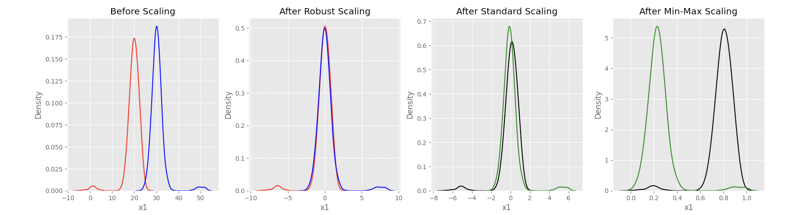

### Handling Categorical Variables

Categorical variables/features are any feature type can be classified into two major types:

- `Nominal`
- `Ordinal`

`Nominal variables` are variables that have two or more categories which do not have any kind of order associated with them. 

For example, if gender is classified into two groups, i.e. male and female, it can be considered as a nominal variable. 

`Ordinal variables`, on the other hand, have “levels” or categories with a particular order associated with them. 

For example, an ordinal categorical variable can be a feature with three different levels: low, medium and high. `Order is important`.

It is a `binary classification` problem, the target here is `not skewed` but we use the best metric for this binary classification problem which would be `Area Under the ROC Curve (AUC)`. We can use precision and recall too, but AUC combines these two metrics. Thus, we will be using AUC to evaluate the model that we build on this dataset.

For now, just know that the AUC-ROC curve helps us `visualize how well our machine learning classifier is performing`. Although it works for only binary classification problems, can extend it to evaluate multi-class classification problems too.


We have to know that computers do not understand text data and thus, we need to convert these categories to numbers. A simple way of doing that can be to use :

- Label Encoding

```python
from sklearn.preprocessing import LabelEncoder
```

- One Hot Encoding

```python
pd.get_dummies()
```

`We need to understand where to use which type of label encoding`

`For not Tree based Machine Learning Algorithms the best way to go will be to use One-Hot Encoding`

- `One-Hot-Encoding` has the advantage that the result is binary rather than ordinal and that everything sits in an orthogonal vector space.

- The disadvantage is that for `high cardinality`, the feature space can really blow up quickly and you start fighting with the curse of dimensionality. In these cases, I typically employ one-hot-encoding followed by PCA for dimensionality reduction. I find that the judicious combination of one-hot plus PCA can seldom be beat by other encoding schemes. PCA finds the linear overlap, so will naturally tend to group similar features into the same feature

`For Tree based Machine Learning Algorithms the best way to go is with Label Encoding`

- `LabelEncoder` can turn [dog,cat,dog,mouse,cat] into [1,2,1,3,2], but then the imposed ordinality means that the average of dog and mouse is cat. Still there are algorithms like decision trees and random forests that can work with categorical variables just fine and LabelEncoder can be used to store values using less disk space.

```python
df[string_col].head()
for col in string_col:
    print(f"The distribution of categorical values in the {col} is : ")
    print(df[col].value_counts())
    print("\n")
```

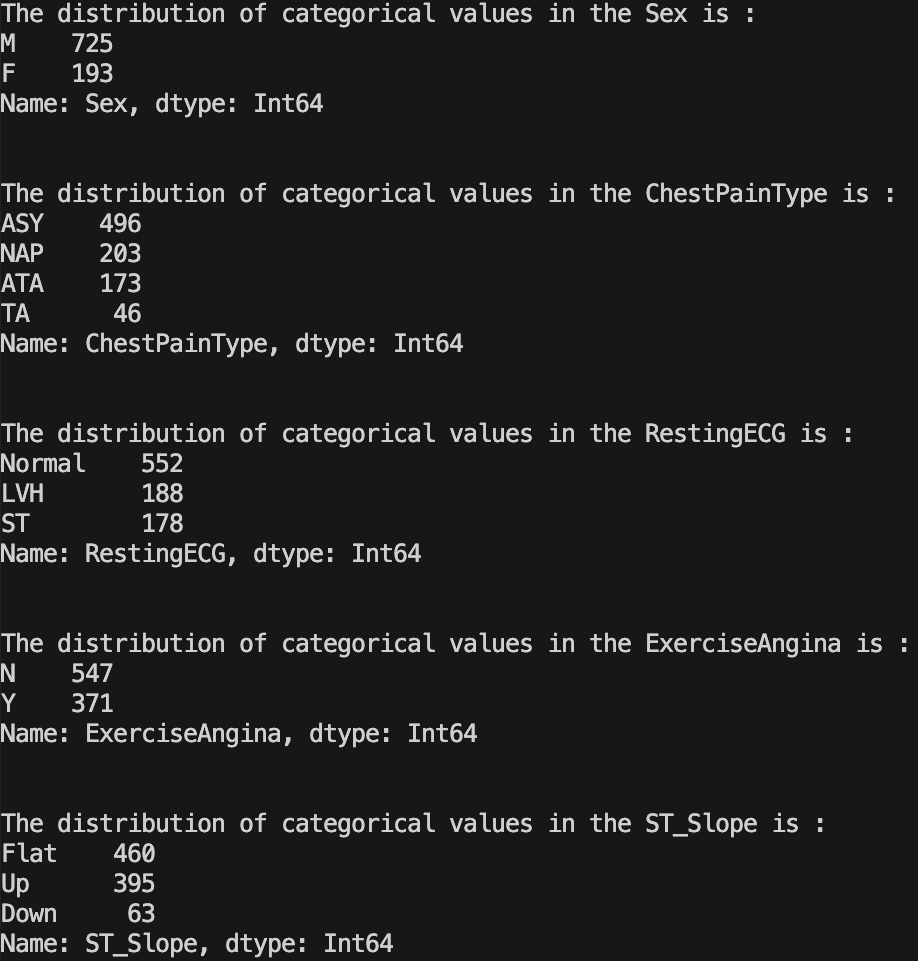

`Label Encoding`
```python
#Label Encoding 
# which will be used with Tree Based Algorthms
df_tree = df.apply(LabelEncoder().fit_transform)
print(df_tree.head())
```
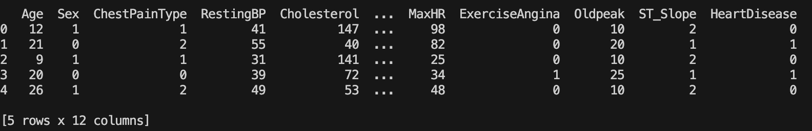


We can use this directly in many tree-based models:

- `Decision trees`
- `Random forest`
- `Extra Trees`

 `Or any kind of boosted trees model`

- `XGBoost`
- `GBM`
- `LightGBM`

This type of encoding cannot be used in linear models, support vector machines or neural networks as they expect data to be normalized (or standardized). For these types of models, we can binarize the data. As shown bellow 

```python
## Creaeting one hot encoded features for working with non tree based algorithms 
df_nontree=pd.get_dummies(df,columns=string_col,drop_first=False)
df_nontree.head()
```
```python
# Getting the target column at the end
target="HeartDisease"
y=df_nontree[target].values
df_nontree.drop("HeartDisease",axis=1,inplace=True)
df_nontree=pd.concat([df_nontree,df[target]],axis=1)
df_nontree.head()
```

### Cross Validation 

Choosing the right cross-validation depends on the dataset you are dealing with, and one’s choice of cross-validation on one dataset may or may not apply to other datasets. However, there are a few types of cross-validation techniques which are the most popular and widely used. These include:

k-fold cross-validation
stratified k-fold cross-validation Cross-validation is dividing training data into a few parts. We train the model on some of these parts and test on the remaining parts 

- `K Fold Validation`
